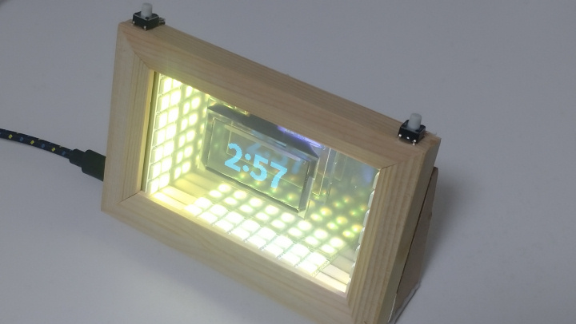
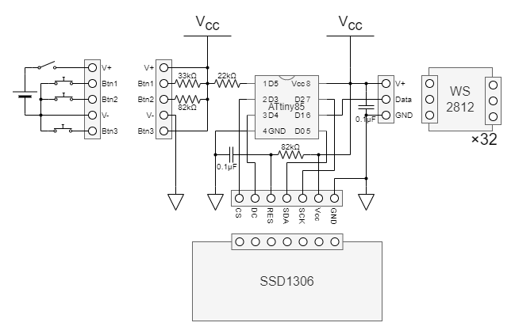
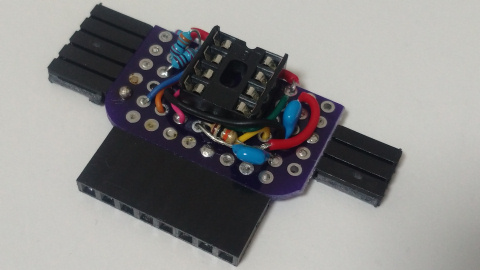
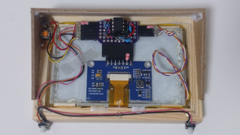
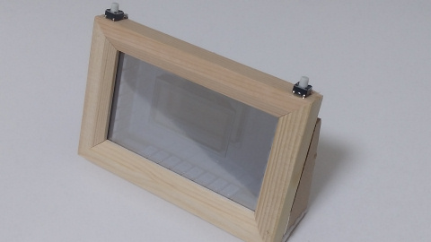

# ATtiny85IllusionFrame

A LED infinity illusion mirror with OLED display controlled by ATtiny85.
Kitchen timer function is available.

## Instruction

You can toggle the mode by holding a button in 1 second.

* Illumination mode
  * Left button: change pattern
  * Right button: change pattern
* Timer mode
  * Left button: minute setting, reset
  * Right button: start/pause

## Hardware

### Components

* A photo frame
* A mirror and a one-way mirror
* ATtiny85
* 1.54 inch 128&times;64 pixels transparent OLED screen SSD1309 SPI
* WS2812 &times; 32
* Resistors
  * 22k&Omega;
  * 33k&Omega;
  * 82k&Omega; &times; 2
* Ceramic capacitors
  * 0.1&micro;F &times; 2
* Wires, connectors, buttons, etc...

### Schematic

### Examples

## Software

### Build environment

[Install ATTinyCore boards to the Arduino IDE](https://github.com/SpenceKonde/ATTinyCore/blob/v2.0.0-devThis-is-the-head-submit-PRs-against-this/Installation.md) and configure the settings as follows.

Attribute        |Value
-----------------|------------------------------
Board            |ATtiny25/45/85 (No bootloader)
Chip             |ATtiny85
Clock            |8 MHz (Internal)
B.O.D. Level     |B.O.D. Disabled (saves power)
Save EEPROM      |EEPROM not retained
Timer 1 Clock    |CPU (CPU frequency)
LTO              |Enabled
millis()/micros()|Enabled

This sketch depends on following library. (You can add this by library manager)

* [Adafruit NeoPixel](https://github.com/adafruit/Adafruit_NeoPixel)

### License

These codes are licensed under [MIT License](LICENSE).

## References

* [How to Make a Modern LED Infinity Illusion Mirror](https://www.youtube.com/watch?v=sAPGw0SD1DE)
* [OLEDリセット回路 - Crescent](http://meerstern.seesaa.net/article/456205002.html)

